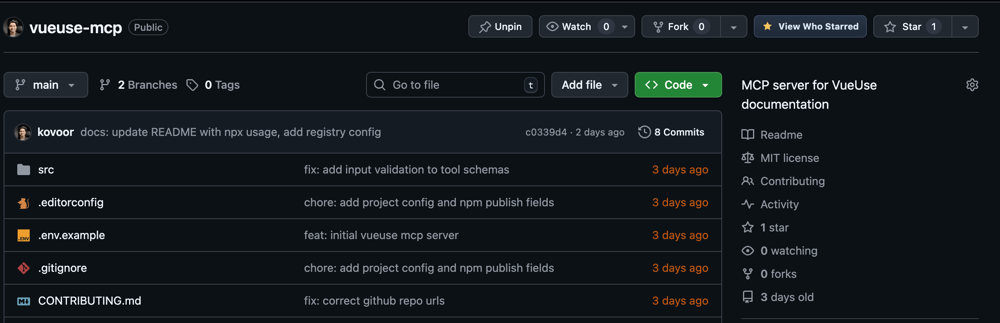
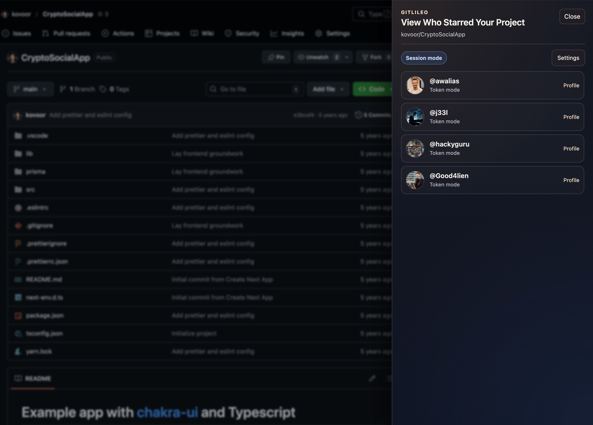
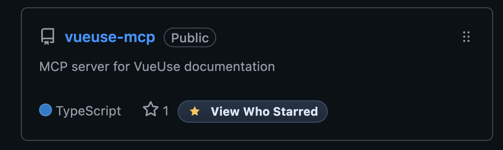

# gitlileo

`gitlileo` is a Chrome extension that adds a **View Who Starred** button on GitHub repository listings and opens a panel to show stargazers for that repository.

## Screenshots

## Features

- Adds `View Who Starred` next to GitHub `Star` controls on repo list views.
- Opens a side panel titled `View Who Starred Your Project`.
- Default mode uses your logged-in GitHub session (no token required).
- Optional token mode (PAT) for stronger API reliability and rate limits.
- Supports GitHub dynamic page updates with automatic reinjection.

## Install (Load Unpacked)

1. Open Chrome and go to `chrome://extensions`.
2. Enable **Developer mode**.
3. Click **Load unpacked**.
4. Select the `gitlileo` folder.
5. Open GitHub and visit a repositories list page.

## Usage

1. On a GitHub repo listing, click `View Who Starred` beside a repo's `Star` button.
2. The extension opens a panel and loads stargazers.
3. Click **Load more** to paginate.
4. If you are not logged in, use the **Log in to GitHub** link in the panel.

## Optional: Personal Access Token Mode

1. Open the panel and click **Settings**.
2. Paste a GitHub token and click **Save token**.
3. The mode chip switches to `Token mode`.
4. Click **Clear** to remove the token and return to session mode.

Recommended token scopes: public repository read scopes are sufficient for public repos.

## Notes

- This extension reads stargazer data from GitHub pages/API and does not modify repositories.
- Token storage uses `chrome.storage.sync`.
